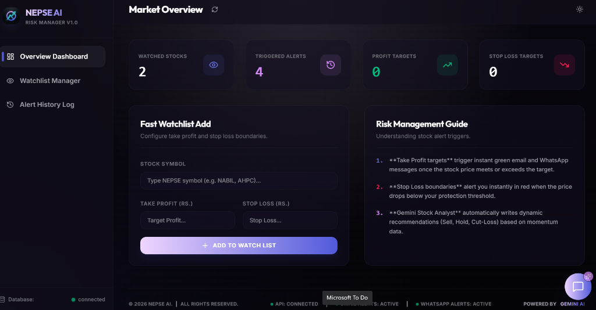
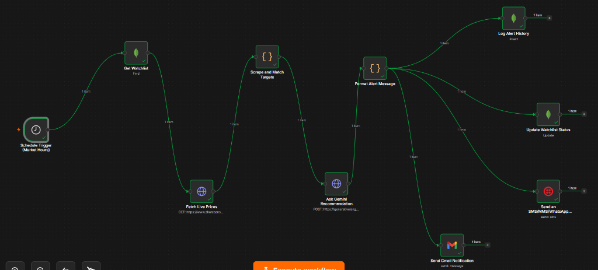

# NEPSE AI — Portfolio Risk & Alert Management System with n8n Automation AI Agent

NEPSE AI is a SaaS-grade, production-ready portfolio risk management ecosystem designed for the Nepal Stock Exchange (NEPSE). It features an interactive, glassmorphic React dashboard, a robust Node.js/Express API backend, and an autonomous **n8n Automation AI Agent** that orchestrates real-time price monitoring, invokes **Google Gemini AI** for smart investment recommendations, updates database watchlist states in **MongoDB**, and triggers instant alerts via **Gmail** and **WhatsApp**.

## 📸 Screenshots

### Web Dashboard


### n8n Automation Workflow


## 💻 Technology Stack & Expertise

This ecosystem uses a modern, high-performance tech stack designed for scalability, low latency, and responsive data visualization:

- **Frontend Core**: **React 19** + **Vite 8** for fast bundling, hot module reloading (HMR), and efficient client-side rendering.
- **Styling & UI**: **Tailwind CSS v4** (including fluid responsive container queries, CSS grids, and customized periwinkle-lavender theme states) + **Lucide Icons** for vector-based UI indicators.
- **Data Visualization**: **Apache ECharts** (via `echarts-for-react`) utilizing SVG rendering for crisp, responsive price comparison gauge/bar charts.
- **Backend API**: **Node.js** + **Express.js** providing REST endpoints for watchlist CRUD operations, status checks, and proxied Gemini AI chat threads.
- **Database Layer**: **MongoDB Atlas** + **Mongoose ODM** handling schema enforcement, indexing, and state tracking for pending and triggered alerts.
- **Orchestration & Workflow**: **n8n Cloud** coordinating scheduled cron jobs, data scrapers, Gemini API nodes, Gmail SMTP nodes, and database state updates.
- **Artificial Intelligence**: **Google Gemini (gemini-3.1-flash-lite)** invoked dynamically via HTTP REST for contextual portfolio question-answering and alert risk analysis.

---

## 🌟 Key Features

### 1. Modern Glassmorphic Dashboard (React & Tailwind v4)
- **Fluid Responsiveness**: Native mobile sidebar drawers, responsive grid layouts, and width-scaling floating panels that adapt seamlessly from 320px mobile screens to large desktop monitors.
- **Obsidian Dark & Clean Light Modes**: Transition animations between a premium obsidian-plum dark palette (`#08060c`) and a clean off-white layout.
- **KPI Summary Metrics**: Real-time totals of active watchlist counts, triggered alerts, pending profits, and stop-loss boundaries.
- **Dynamic ECharts Visualizations**: Dynamic bar and gauge charts comparing execution prices directly against custom profit/loss target thresholds.
- **Gemini Chat Assistant**: A floating, responsive chat drawer (`w-[calc(100vw-32px)] sm:w-96`) that allows users to ask Gemini AI about watchlist statuses, alert logs, and portfolio advice.

### 2. Express Backend API Server
- **Watchlist Controller**: Create, retrieve, and delete stock watchlist items directly in MongoDB.
- **Alert History Logger**: Persists historical logs of triggered stock alerts with execution prices, AI insights, and precise timestamps.
- **Gemini AI Integration**: Powers conversational chat requests by combining user queries with real-time portfolio watchlist and alert history contexts.

### 3. n8n Automation AI Agent
- **Autonomous Price Scraper**: Automatically scrapes live stock prices from ShareSansar during NEPSE market trading hours (Sunday to Thursday, 11:00 AM – 3:00 PM Nepal Time).
- **Intelligent Alert Matching**: Matches live prices against your custom target prices:
  - **Take Profit (LTP >= targetSellPrice)** 📈
  - **Stop Loss (LTP <= targetLossPrice)** 📉
- **AI Decision Node**: Calls the Google Gemini LLM to analyze the stock's volume, daily price range, and momentum to draft a personalized Sell/Hold/Buy action recommendation.
- **State & Notification Orchestration**: Updates watchlist items to `triggered` in MongoDB, logs transaction history, and dispatches rich HTML emails to your Gmail inbox.

---

## 📂 Project Architecture & Directory Structure

```
n8n-cloud-nepse-alert-ai/
├── backend/                  # Express REST API Server
│   ├── server.js             # API entrypoint and database schemas
│   ├── package.json          # Node dependencies (express, mongoose, dotenv, cors)
│   ├── .env                  # Backend environment secrets (ignored by git)
│   └── .env.example          # Backend environment template
├── frontend/                 # Vite + React + Tailwind v4 Frontend
│   ├── src/
│   │   ├── App.jsx           # Main Dashboard UI and state orchestration
│   │   ├── index.css         # Tailwind v4 directives and theme variables
│   │   └── main.jsx          # React app entry point
│   ├── public/
│   │   └── kairos_logo.png   # Generated brand logo asset
│   ├── package.json          # Frontend dependencies (echarts, lucide-react, axios)
│   ├── vite.config.js        # Vite build configurations with dev server proxy
│   ├── .env                  # Frontend production URL settings (ignored by git)
│   └── .env.example          # Frontend environment template
├── n8n/                      # Serverless Workflow Files
│   └── nepse_alert_workflow.json # n8n visual automation configuration JSON
├── scratch/                  # Scripts for developer testing & simulation
└── .gitignore                # Global git ignore configuration
```

---

## 🛠️ Local Development Setup

### 1. Prerequisites
- **Node.js**: `v18.x` or higher
- **npm**: `v9.x` or higher
- **MongoDB**: A local MongoDB server running or a free [MongoDB Atlas](https://www.mongodb.com/products/platform/atlas-database) Cluster.

### 2. Configure Backend Environment
1. Navigate to the `backend/` directory:
   ```bash
   cd backend
   ```
2. Create your `.env` file based on `.env.example`:
   ```bash
   cp .env.example .env
   ```
3. Open `backend/.env` and fill in your variables:
   ```env
   PORT=5000
   MONGO_URI=mongodb+srv://<username>:<password>@cluster.mongodb.net/nepse_alerts?retryWrites=true&w=majority
   GEMINI_API_KEY=your_gemini_api_key_from_google_ai_studio
   ```

### 3. Run Backend Server
1. Install dependencies:
   ```bash
   npm install
   ```
2. Start the development server (runs on `http://localhost:5000` with hot-reload via nodemon):
   ```bash
   npm run dev
   ```

### 4. Run Frontend Dashboard
1. Open a new terminal window and navigate to the `frontend/` directory:
   ```bash
   cd frontend
   ```
2. Create your `.env` file for local development:
   ```bash
   cp .env.example .env
   ```
   *(Keep `VITE_API_BASE_URL` empty to automatically utilize the built-in Vite dev proxy configured in `vite.config.js`)*.
3. Install dependencies:
   ```bash
   npm install
   ```
4. Start the frontend dev server (runs on `http://localhost:5173`):
   ```bash
   npm run dev
   ```

---

## ☁️ n8n Cloud Automation Setup

1. Copy the entire contents of [n8n/nepse_alert_workflow.json](file:///C:/Users/aarya/.gemini/antigravity/scratch/n8n-cloud-nepse-alert-ai/n8n/nepse_alert_workflow.json).
2. Log in to your **n8n Cloud** dashboard and create a **New Workflow**.
3. Paste the copied JSON (`Ctrl+V` or `Cmd+V`) directly onto the visual canvas.
4. Set up credentials for the nodes:
   - **MongoDB Nodes**: Create a MongoDB Credential and input your MongoDB Atlas connection string.
   - **Gemini Node**: Open the "Ask Gemini Recommendation" node and replace the query parameter value for `key` with your Google AI Studio Gemini API Key.
   - **Gmail Node**: Click "Create New Credential" and complete the secure sign-in authorization with Google.
5. Toggle the workflow to **Active** to begin automated tracking.

---

## 🚀 Production Deployment (Decoupled Architecture)

### 1. Deploy the API Backend
1. Deploy the `backend/` subfolder to **Render**, **Railway**, or **Koyeb**.
2. Configure environment variables in your hosting provider's dashboard:
   - `MONGO_URI`
   - `GEMINI_API_KEY`
   - `PORT=5000` (Render/Railway will map this to the internet automatically).
3. The platform will output a live URL (e.g., `https://nepse-api.onrender.com`).

### 2. Deploy the Frontend
1. Deploy the `frontend/` subfolder to **Vercel** or **Netlify**.
2. Set the build parameters:
   - **Framework Preset**: `Vite`
   - **Root Directory**: `frontend`
   - **Build Command**: `npm run build`
   - **Output Directory**: `dist`
3. Configure the following environment variable in Vercel/Netlify:
   - `VITE_API_BASE_URL` = `https://nepse-api.onrender.com` (replace with your live backend API URL).
4. Deploy the project. The platform will serve the dashboard globally.
